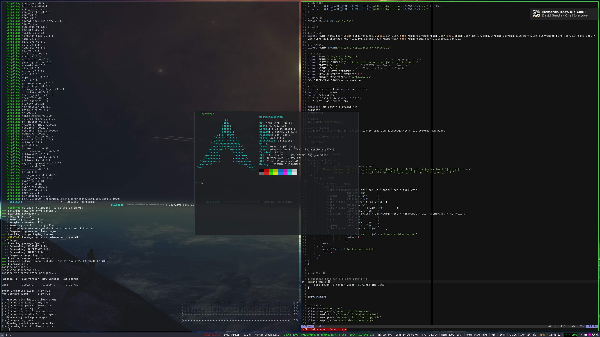

msa's dotfiles
============

Will be some fancy text here.

### [Appearance](Appearance)

#### Desktop

#### Kitty

#### ST

#### I3

#### VIm

#### Emacs

#### Ncspot

##### TODOs
* Wiki
* Clean
* Dependencies
